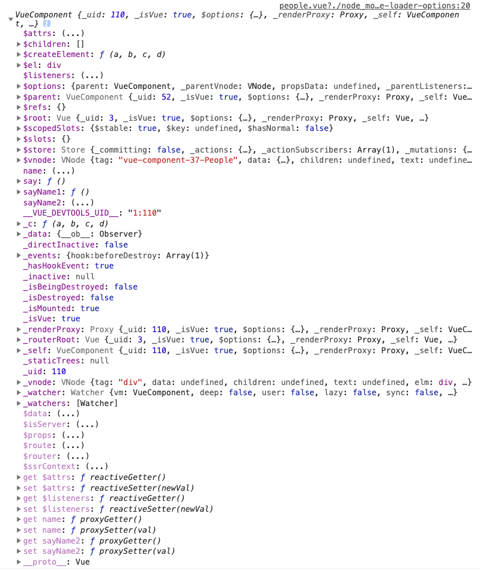
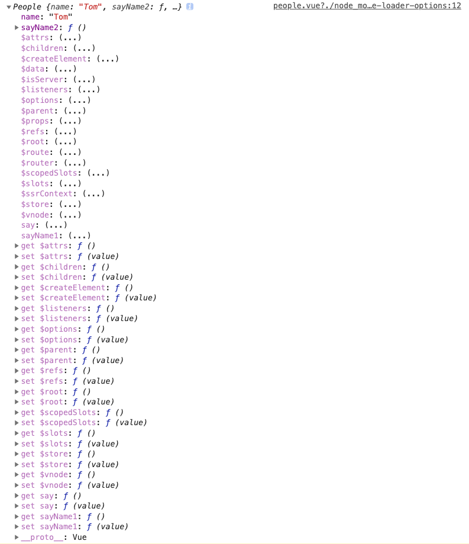

## 引子

在vue3出来之前，vue与ts结合的一直不算太好。目前vue+ts的项目，大部分是使用vue class component + 装饰器来实现。之前并未关注过vue-class-component中`@Component`装饰器是如何实现的，直到遇到了一个关于this指向的问题。

## 问题

```typescript
import { Vue, Component } from 'vue-property-decorator';

@Component
export default class People extends Vue{
    name = 'Tom';

    sayName1() {
        console.log(this.name);
    }

    // 注意，此处通过箭头函数定义
    sayName2 = () => {
        console.log(this.name);
    }

    say() {
        this.name = 'Jack';
        this.sayName1(); // 输出什么？
        this.sayName2(); // 输出什么？
    }
}
```

上述代码，可能会觉得`sayName1`与`sayName2`都输出`Tom`，也可能会觉得`sayName1`输出`Tom`，`sayName2`输出`undefined`。

实际上这两种都不对，运行之后，`sayName1`输出了`Jack`，`sayName2`输出了`Tom`。

## class中的methods

一般而言，箭头函数是没有`this`的，它的`this`指向永远是定义时包裹它的代码块的`this`。因此，可能有部分人认为，上面代码`sayName2`中的`this`指向`window`，而`window`上没有`name`，因此输出`undefined`。

然而常写React的人应该知道，通过箭头函数定义methods的方式已经比较常见了，在里面并不会出现`this`指向`window`的问题，这是什么缘故呢？我们还是将对应代码编译成es5的代码看看。

```javascript
// 为了减少干扰性，编译前已经去除Vue相关
var People = /** @class */ (function () {
    function People() {
        var _this = this;
        this.name = 'Tom';
        // 注意，此处通过箭头函数定义
        this.sayName2 = function () {
            console.log(_this.name);
        };
    }
    People.prototype.sayName1 = function () {
        console.log(this.name);
    };
    People.prototype.say = function () {
        this.name = 'Jack';
        this.sayName1(); // 输出什么？
        this.sayName2(); // 输出什么？
    };
    return People;
}());
```

因为项目中使用的TypeScript，上述代码直接使用[TypeScript](https://www.tslang.cn/play/index.html)编译。

从编译后的结果来看就很清晰了，class中普通方法是定义在`prototype`上，而通过箭头函数定义的method，却是直接定义在实例上，并且将`this`也绑定到了当前实例。这实际上和箭头函数在其他地方的表现有所不同，但这更符合直觉，因为一般而言，我们默认class中methods的`this`就应该指向当前实例，没有人愿意在绑定方法的时候写一大堆`bind(this)`。

## @Component装饰器的乱入

有心之人可以发现，当我们去除vue相关内容后，上述代码输出均为`Jack`。

```typescript
class People{
    name = 'Tom';

    sayName1() {
        console.log(this.name);
    }

    // 注意，此处通过箭头函数定义
    sayName2 = () => {
        console.log(this.name);
    }

    say() {
        this.name = 'Jack';
        this.sayName1(); // 输出Jack
        this.sayName2(); // 输出Jack
    }
}
```

很容易想到，在vue代码中之所以会有不同的表现，肯定是因为增加了`@Component`装饰器的缘故。

在vue组件的`sayName1`和`sayName2`中分别打印下`this`，结果如下

`sayName1`输出结果


`sayName2`输出结果


可以发现，`sayName1`中的`this`，实际上是一个`VueComponent`对象，`sayName2`中的`this`才指向的是`People`对象。

这么看来，经过`@Component`包裹后的class，已经变成了`VueComponent`，来看下对应的源码实现。

```typescript
export function componentFactory (
    Component: VueClass<Vue>,
    options: ComponentOptions<Vue> = {}
  ): VueClass<Vue> {

    // 删减具体处理逻辑

    // find super
    const superProto = Object.getPrototypeOf(Component.prototype)
    const Super = superProto instanceof Vue
      ? superProto.constructor as VueClass<Vue>
      : Vue
    const Extended = Super.extend(options)

    return Extended
}
```

上面是经过删减后的代码，可以看到，`@Component`装饰器的本质，是将通过class定义的组件中的属性，放到了一个`options`当中，然后通过`Vue.extend`扩展出了一个子类，最后将这个子类返回。

因此，使用`@Component`装饰器后，普通方法里面的`this`早已经不是指向原来的`People`对象，而是指向这个通过`Vue.extend`出来的子类。箭头函数里的则依然指向了`People`对象。

从`@Component`装饰器的实现可以看出，vue本身使用的配置化的语法和typescript支持得确实不太好，装饰器的实现也比较trick，强行将class转换成了一个options对象，这和React是有区别的。