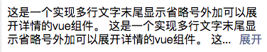
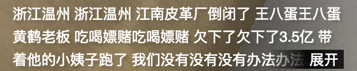

## 需求

UI有时可能会提这样的需求，当文本超过一定行数时，末尾展示省略号加展开按钮，如图所示：


## 思路

要实现如图所示的效果，主要有两个难点，一个是判断行数，一个是末尾的省略号和展开按钮。

对于第一点，浏览器提供了一个[window.getComputedStyle()](https://developer.mozilla.org/zh-CN/docs/Web/API/Window/getComputedStyle)方法，可以用于获取dom元素经过计算后的css属性值，我们可以通过该方法获取dom的height以及文字lineHeight，从而计算出当前行数。

对于第二点，最初的尝试是直接将 **...更多** 设置不透明，遮住底部文字，这种方式的弊端是容易遮住一半文字，在 *-webkit-line-clamp* 属性出来之前多用于实现多行文字末尾省略号效果，如图所示：


很显然，这种方法极不优雅，只能算是勉强实现，离UI所期望的效果差远了。于是只能换一种其他方式，循环删除待显示文本的最后一个字符，然后判断当前行数是否等于规定行数，如果达到规定行数了则一次性删除3个字符，给 **...更多** 留出展示空间。

实现代码如下：

```javascript
const textEle = this.$refs.text;
let textStyle = getComputedStyle(textEle);
const fontSize = Number.parseFloat(textStyle.fontSize.replace('px', ''), 10);
// 各个浏览器对line-height默认值normal实现不同，一般在字体的1.0到1.2倍之间，这里采用1.2倍
const lineHeight = textStyle.lineHeight === 'normal' ? fontSize * 1.2
    : Number.parseFloat(textStyle.lineHeight.replace('px', ''), 10);

// 清除行内样式所设置的高度值
textEle.style.height = '';
let autoHeight = Number.parseFloat(textStyle.height.replace('px', ''), 10);
// 若文字内容不足设定行数，直接不展示末尾按钮
if (autoHeight < lineHeight * this.line) {
    return;
}
this.hasDeleteWords = true;
const deleteEndWords = () => {
    this.content = this.content.substr(0, this.content.length - 1);
    this.$nextTick(() => {
        // 待dom更新后重新获取样式
        textStyle = getComputedStyle(textEle);
        textEle.style.height = '';
        autoHeight = Number.parseFloat(textStyle.height.replace('px', ''), 10);
        if (autoHeight > lineHeight * this.line) {
            deleteEndWords();
        } else {
            // 最后一行末尾少3个字符
            this.content = this.content.substr(0, this.content.length - 3) + this.endChars;
        }
    });
```

完整代码见：[github](https://github.com/WustLCQ/vue-multline)

已封装成组件上传npm，可直接使用：

```
npm install --save vue-multline
```

```html
<vue-multline
    :text="text"
/>
```