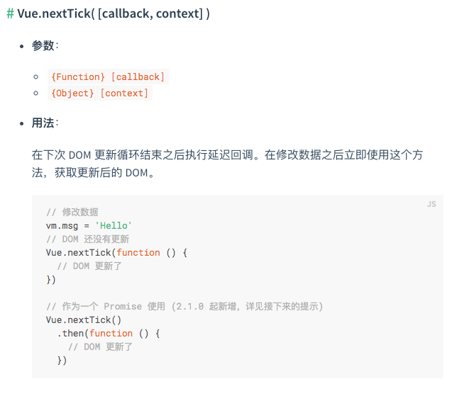

## 写在前面

最近在看vue中nextTick时，发现nextTick只是个普通的异步队列，遂产生好奇，nextTick是如何保证在UI更新执行的呢？根据这个问题探究下去，最后发现自己之前对nextTick的理解有偏差，于是总结了一下。

## 例子

```html
<template>
    <span ref="text" @click="handleClick">{{name}}</span>
</template>
```
```javascript
export default {
    data() {
        return {
            name: 'zhang'
        };
    }
    handleClick() {
        this.$nextTick(() => {
            console.log(this.$refs.text.innerHTML);
        });
        this.name = 'wang';
    }
}
```

首先思考如上一个例子，点击之后输出什么？如果你的答案是输出**wang**，那你有必要继续看下去。

## 答案

上面输出的是**zhang**，即更新前的数据。

可能有不少同学和我之前一样，认为nextTick执行是在dom之后，获取的是更新后的dom，毕竟vue文档中都是这么写的。

官方文档当然没错，可需要注意的是
> 在修改数据**之后**立即使用这个方法，获取更新后的 DOM

也就是说，如果上文中的`this.name = 'wang'`是在nextTick之前，那确实获取后的dom，输出wang。可上文中`this.name = 'wang'`在nextTick之后，那输出的就是更新前的数据。这里面的原理，就是本文需要说明的了。

## nextTick实现原理

对于js的事件循环以及microtasks、macrotasks等相关知识，网上相关文章已经很多了，本文不再赘言。

众所周知，vue中的dom是异步更新的，要获取到更新后的dom，需要使用nextTick方法。那么，你是否思考过，nextTick是如何获取到更新后的dom的？

要探究这个问题，自然得从vue的源码中来。nextTick所在的源码很好找，在`src/core/util/next-tick.js`文件中，总共也只有一百多行，主要内容是一段`if...else...`语句。

```javascript
// The nextTick behavior leverages the microtask queue, which can be accessed
// via either native Promise.then or MutationObserver.
// MutationObserver has wider support, however it is seriously bugged in
// UIWebView in iOS >= 9.3.3 when triggered in touch event handlers. It
// completely stops working after triggering a few times... so, if native
// Promise is available, we will use it:
/* istanbul ignore next, $flow-disable-line */
if (typeof Promise !== 'undefined' && isNative(Promise)) {
} else if (!isIE && typeof MutationObserver !== 'undefined' && (
  isNative(MutationObserver) ||
  // PhantomJS and iOS 7.x
  MutationObserver.toString() === '[object MutationObserverConstructor]'
)) {
  // Use MutationObserver where native Promise is not available,
  // e.g. PhantomJS, iOS7, Android 4.4
  // (#6466 MutationObserver is unreliable in IE11)
} else if (typeof setImmediate !== 'undefined' && isNative(setImmediate)) {
  // Fallback to setImmediate.
  // Techinically it leverages the (macro) task queue,
  // but it is still a better choice than setTimeout.
} else {
  // Fallback to setTimeout.
}
```

`if...else...`当中具体内容省略了，只看这几个条件，很明显，这是一段降级策略。

首选是`Promise`，如果宿主环境支持`Promise`，直接用`Promise`实现nextTick。对于不支持`Promise`的环境，判断是否支持`MutationObserver`，如果支持，则使用`MutationObserver`实现nextTick。如果都不支持，依次降级，尝试使用`setImmediate`、`setTimeout`。

nextTick源码的主要逻辑很简单，核心思路就是将回调函数放到异步队列中，microtasks不行就macrotasks。可UI更新呢？不是说nextTick获取到的是更新后的dom吗？这仅仅是放在了异步队列中，如何保证获取到的是更新后的dom？事实上，nextTick确实没保证获取到的是更新后的dom。UI更新和nextTick中的回调函数是加入到了同一个异步队列当中，优先级相同，所以出现了上面例子中的情况，数据改变在nextTick之前，则获取到的是更新后的dom，反之，数据改变发生在nextTick之后，获取到的是更新前的dom。

注意，`MutationObserver`虽然可以监视dom的更改，但vue中并没用到这一点，别被误导了。vue中仅仅是用到了`MutationObserver`创建microtasks的能力。

## 异步更新队列

事实上，vue中的异步更新队列也是通过nextTick实现的。

更新vue实例中的数据时，会执行Watcher对象的update方法，源码如下

```javascript
update () {
  /* istanbul ignore else */
  if (this.lazy) {
    this.dirty = true
  } else if (this.sync) {
    this.run()
  } else {
    queueWatcher(this)
  }
}
```

在默认情况下，观察者对象异步更新，调用`queueWatcher`函数加入异步更新队列。`queueWatcher`函数在`src/core/observer/scheduler.js `中，源码如下

```javascript
/**
 * Push a watcher into the watcher queue.
 * Jobs with duplicate IDs will be skipped unless it's
 * pushed when the queue is being flushed.
 */
export function queueWatcher (watcher: Watcher) {
  const id = watcher.id
  if (has[id] == null) {
    has[id] = true
    if (!flushing) {
      queue.push(watcher)
    } else {
      // if already flushing, splice the watcher based on its id
      // if already past its id, it will be run next immediately.
      let i = queue.length - 1
      while (i > index && queue[i].id > watcher.id) {
        i--
      }
      queue.splice(i + 1, 0, watcher)
    }
    // queue the flush
    if (!waiting) {
      waiting = true

      if (process.env.NODE_ENV !== 'production' && !config.async) {
        flushSchedulerQueue()
        return
      }
      nextTick(flushSchedulerQueue)
    }
  }
}
```

`queueWatcher`函数中做了一些边界处理的工作，暂时不用去关心，可以看到，最终将回调函数加入异步队列的就是`nextTick(flushSchedulerQueue)`这一句。

这下子清楚了，vue中对UI的更新，确实是使用nextTick实现的，因此，nextTick中的回调函数并非一定获取到的就是所有更新完成的dom，还需要看nextTick到底写在哪里。