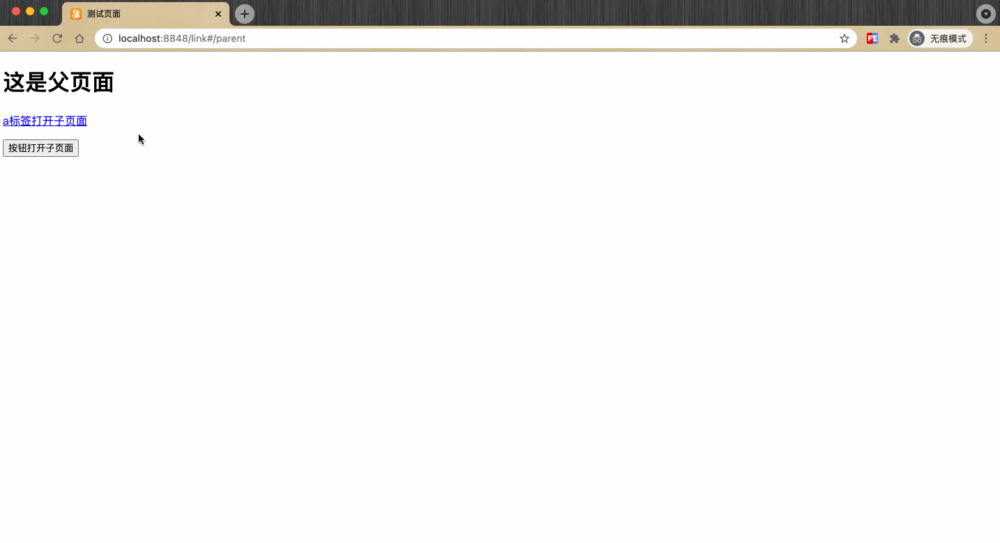
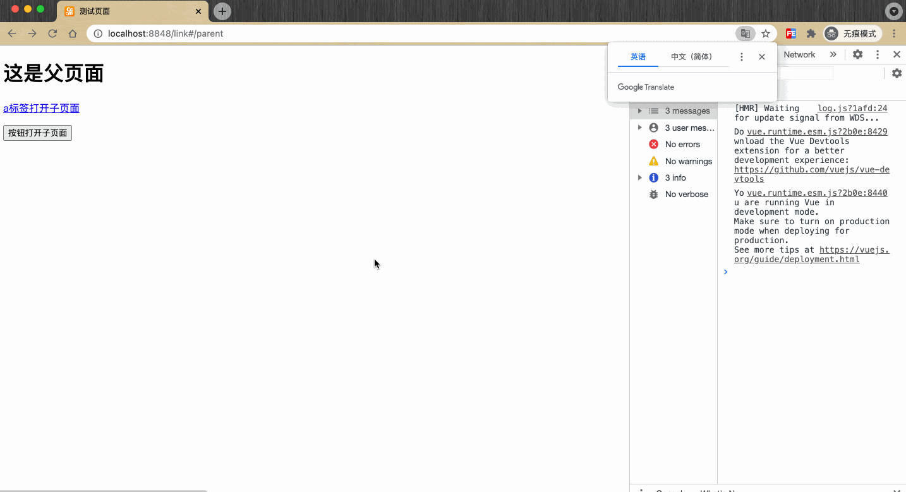
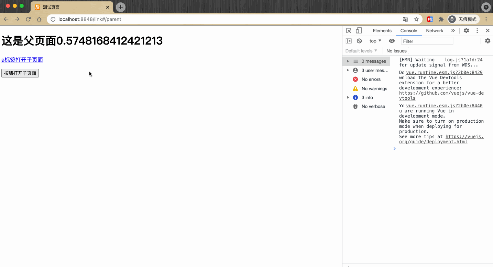

## 从一个愚蠢的bug说起

之前的需求中遇到了一个愚蠢的bug，大致是这样的：用户详情页A1 ——> 用户详情页A2 ——> 用户详情页A3，期望每次都是打开新标签页跳转。很简单一个需求，然而在实现的过程中，我除了第一次是新开标签页跳转，后续页面全是在已经打开的标签页刷新，大致过程如下：



可以看到，通过a标签打开的子页面正常，而通过`window.open()`打开的新标签页只有第一次成功打开了新标签页。

这个现象引起了我的关注，遂去网上搜索相关case，然而任我变化关键字，也没发现有其他人遇到和我类似的问题。于是我意识到，可能是我犯了一些低级错误……经过反复排查，最终定位到了问题

```javascript
window.open(url, '_target');
```

原来是我把`window.open()`的第二个参数，从`_blank`写成了`_target`。

参考[MDN](https://developer.mozilla.org/zh-CN/docs/Web/API/Window/open)，`window.oepn()`支持3个参数，

```javascript
let windowObjectReference = window.open(strUrl, strWindowName, [strWindowFeatures]);
```

```
strUrl === 要在新打开的窗口中加载的URL。

strWindowName === 新窗口的名称。

strWindowFeatures === 一个可选参数，列出新窗口的特征(大小，位置，滚动条等)作为一个DOMString。
```

> 如果已经存在以 strWindowName 为名称的窗口，则不再打开一个新窗口，而是把 strUrl 加载到这个窗口中。在这种情况下，方法的返回值是这个已经打开的窗口，并忽略参数 strWindowFeatures 。strUrl设为空字符串时，可以在不改变窗口地址的情况下获得一个已经打开的同名窗口的引用。如果要在每次调用 window.open()时都打开一个新窗口，则要把参数 strWindowName 设置为 _blank。

问题至此迎刃而解，不过在搜索`window.open()`相关资料的问题中，倒是发现了`window.open()`在日常使用中存在的安全和性能问题，将其一起整理下。

## 安全问题

### 例子1

#### 现象

* 任意打开一个页面，F12打开开发者工具
* 控制台Console中输入`window.open('https://www.baidu.com')`
* 在新开的标签页中，打开开发者工具，控制台Console中输入`window.opener.location='https://www.baidu.com'`
* 咦？原有页面变成了百度首页



#### 危害

既然可以修改父窗口的链接，让父窗口显示指定的页面，那么第一个想到的危害肯定就是钓鱼网站。

* 正常浏览页面，打开外链跳到其他站点
* 新页面通过修改`window.opener.location`将原页面替换为一模一样的钓鱼页面，并引导用户重新登陆
* 输入账号密码，账号被盗

当然，如果细心一些，再回到原页面的时候，可能会发现域名变了，然而正常浏览中谁会时刻关注域名的变化呢。

#### 原因

通过`window.open(url)`打开的新页面，会有个`window.opener`对象，从[MDN](https://developer.mozilla.org/zh-CN/docs/Web/API/Window/opener)得知，这个对象指向打开当前窗口的那个窗口引用，例如：在window A中打开了window B，B.opener 返回 A。

如果父页面和新开窗口中的页面是不同域名的，浏览器会禁止新窗口访问opener中的内容。但是有一个操作除外：可以通过window.opener.location = newURL来重写父页面的url，即使与父窗口的页面不同域。

## 性能问题

### 例子2

#### 现象

* 打开测试页面，测试页面上有个随机数，随机数10ms变动一次
* 点击按钮打开新标签页，在新标签页中打开开发者工具，点击debug按钮
* 回到原页面，发现随机数暂停变动了，说明被debug阻塞



#### 危害

从上面示例可以看出，新页面的js执行会阻塞原页面的js，如果新页面的js运行比较耗时，势必会导致原页面的卡顿。

#### 原因

`window.open(url)`在新窗口中打开页面, 会与父窗口共用进程和线程，因为opener里有DOM信息，两个进程同时控制DOM信息，在多进程下比较难控制，因此干脆放到了一个进程里。

## 防范

既然知道了问题所在，那自然也知道如何防范了。我们的思路是设置opener为空

```javascript
const newWnd = window.open(url);
newWnd.opener = null;
newWnd.location = url;
```

## 关于a标签

网络上的一些博客中说，通过a标签使用`target="_blank"`方式打开的新页面也会存在opener的安全问题，需要加上`rel="noopener"`来防范。不过经过我测试之后，目前的chrome(91.0.4472.77)中的a标签已经不存在这问题，Safari依然存在。在网上搜索一番，发现Chrome现在已经默认把a标签的rel设置为noopener了[ Feature: Anchor target=_blank implies rel=noopener by default](https://www.chromestatus.com/feature/6140064063029248)