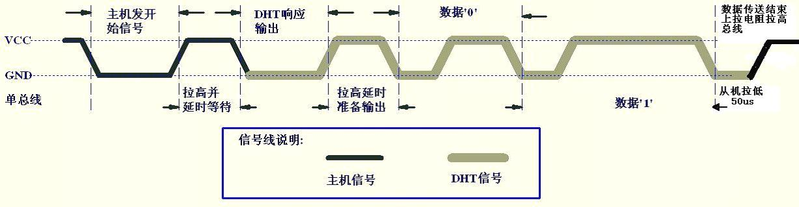
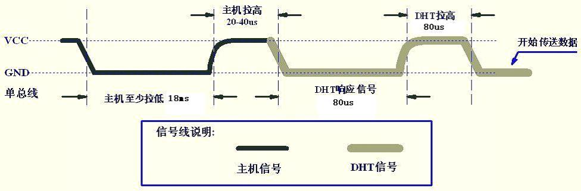
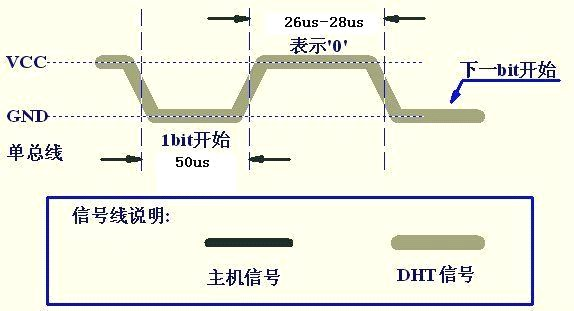
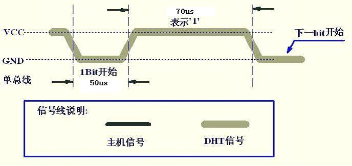

上篇文章中进行了风速的测量，这篇文章来介绍温湿度的测量。
# 传感器相关
本文中用的温湿度传感器是DHT11，相关资料如下：http://pan.baidu.com/s/10CeBk
DHT11有3个引脚，VCC、DATA、GND。供电电压为3~5.5V。因此，可以将VCC接到树莓派的1号引脚，DATA接到树莓派的11号引脚，GND接到树莓派的9号引脚。
## 数据格式
DATA引脚用于微处理器与DHT11之间的通讯和同步，采用单总线数据格式，一次
通讯时间4ms左右，数据分小数部分和整数部分，具体格式在下面说明，**当前小数部分用于以后扩展，现读出为零**。操作流程如下：
一次完整的数据传输为40bit，高位先出。
数据格式：8bit湿度整数数据+8bit湿度小数数据+8bi温度整数数据+8bit温度小数数据+8bit校验和
数据传送正确时校验和数据等于“**8bit湿度整数数据**+**8bit湿度小数数据**+**8bi温度整数数据**+**8bit温度小数数据**”所得结果的末8位。因为温度+湿度一般情况下都会小于128，因此可以直接用温度+湿度是否等于校验和来进行校验。
## 数据传输过程


主机先发送至少18ms的低电平，保证DHT11能检测到起始信号。然后拉高20~40us，开始接收DHT11的响应信号。DHT11先发送80us的相应信号，然后拉高80us，之后便开始进行数据传输，其中，0和1的表示方法如下：



# 代码实现
树莓派有各种集成库，因为数据传输过程涉及到微秒级的延时，本文选用wiringPi来进行GPIO操作。
## 实现思路
为了防止延时不精确，本次编码过程中，如果遇到需要判断DHT11是否发送了80us的低电平，先延时了70us，然后轮询，直到收到高电平为止，如果轮询的过程超过了20us，则认为出错，终止程序。判断0和1则是在数据位高电平40us左右时，根据此时收到的电平信号是低还是高来判断是0还是1.
## 具体代码
```
#include<wiringPi.h>
#include<stdio.h>
#include<time.h>

int pin = 0;
int readBit(){
	int data;
	pinMode(pin, INPUT);
	if(digitalRead(pin)){
		return -1;
	}	

	int little = 0;
	while(!digitalRead(pin))
	{
		little++;
		delayMicroseconds(1);
		if(little>60){
			return -2;
		}
	}
	delayMicroseconds(40);
	if(digitalRead(pin))
	{
		data = 1;
	}else
	{
		data = 0;
	}
	little = 0;
	while(digitalRead(pin))
	{
		delayMicroseconds(1);
		little++;
		if(little>60)
		{
			return -3;
		}
	}
	return data;
}
int main(void)
{
	float temperatureInt, temperatureDec, humidityInt, humidityDec, check;
	float times;
	int i, little;
	FILE *fp;
	time_t rawtime;
	struct tm* timeinfo;

	time(&rawtime);
	timeinfo = localtime(&rawtime);

	temperatureInt = 0.0;
	temperatureDec = 0.0;
	humidityInt = 0.0;
	humidityDec = 0.0;
	check = 0.0;
	wiringPiSetup();
	pinMode(pin, OUTPUT);

	//Host push to LOW at least 18ms
	digitalWrite(pin, LOW);
	delay(18);

	//Host pull to HIGH for 20~40us
	digitalWrite(pin, HIGH);
	delayMicroseconds(30);

	//DHT begin to reply
	pinMode(pin, INPUT);

	//DHT reply LOW for 80us
	while(digitalRead(pin))
	{
		delayMicroseconds(1);
	}
	little = 0;
	delayMicroseconds(70);
	while(!digitalRead(pin))
	{
		delayMicroseconds(1);
		little++;
		if(little > 20)
		{
			printf("DHT low 80us error.\n");
			return -1;
		}
	}

	//DHT pull to HIGH for 80 us
	little = 0;
	delayMicroseconds(70);
	while(digitalRead(pin))
	{
		delayMicroseconds(1);
		little++;
		if(little > 20)
		{
			printf("DHT high 80us error.\n");
			return -1;
		}
	}
	for(i=0; i<8; i++)
	{
		int data = readBit();
		if(data >=0)
		{

			humidityInt = humidityInt*2 + data;
		}else
		{
	 		printf("HumidityInt has occured an error , i is %d, data is %d.\n",i, data);
			return -1;
		}
	}
	times = 1;
	for(i=0; i<8; i++)
	{
		int data = readBit();
		if(data >= 0)
		{
			times /= 2;
			humidityDec += data*times;
		}else
		{
			printf("HumidityDec has occured an error, i is %d, data is %d.\n",i, data);
			return -1;
		}	
	}
	for(i=0; i<8; i++)
	{
		int data = readBit();
		if(data >= 0)
		{
			temperatureInt = temperatureInt*2 + data;
		}else
		{
			printf("TemperatureInt has occured an error, i is %d, data is %d.\n", i, data);
			return -1;
		}
	}
	times = 1;
	for(i=0; i<8; i++)
	{
		int data = readBit();
		if(data >= 0)
		{
			times /= 2;
			temperatureDec += data*times;
		}else{
			printf("TemperatureDec has occured an error, i is %d, data is %d.\n",i, data);
			return -1;
		}	
	}
	for(i=0; i<8; i++)
	{
		int data = readBit();
		if(data >= 0)
		{
			check = check*2 + data;
		}else
		{
			printf("Check has occured an error, i is %d, data is %d.\n", i, data);
			return -1;
		}
	}
	printf("%s",asctime(timeinfo));
	printf("Temperature =%.6f℃, Humidity =%.6f%, Check =%.0f.\n",temperatureInt+temperatureDec,humidityInt+humidityDec,check);
	
	if((fp = fopen("T&H.txt", "a+")) == NULL)
	{
		printf("File cannot be opened.\n");
		return -1;
	}

	fprintf(fp,"%4d-%02d-%02d %02d:%02d:%02d T =%.0f℃ H =%.0f%\n",timeinfo->tm_year+1900, timeinfo->tm_mon+1, timeinfo->tm_mday, timeinfo->tm_hour, timeinfo->tm_min, timeinfo->tm_sec, temperatureInt, humidityInt);
	fclose(fp);
}
```