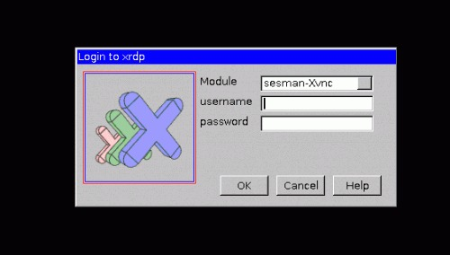

老师突然布置了一个任务，要测量室外温度、湿度、风速，至少测量1天24小时以上的数据，数据测量密度可以是30s的间隔或1分钟。
鉴于实验室正好有个风速计，遂决定先将风速计连接在树莓派上进行测试，然后再购买温度湿度传感器。

# 树莓派配置
实验室空闲的树莓派上没有系统，于是决定先烧写系统。百度的时候发现树莓派现在已经很方便了，可以直接通过NOOBS安装，任何多余的工具都不需要安装。
到https://www.raspberrypi.org/downloads/下载NOOBS，建议下载离线版本，约1.1G。下载完成后，将zip文件解压到为树莓派准备好的SD卡中。文件内容如下

将SD卡插入树莓派中，上电，选择系统进行安装。
系统安装好后，为了更方便地使用，再给树莓派安装些其他的工具。
## 安装vim
大名不必多说
`sudo apt-get install vim`
## 安装xrdp
为了能在windows上远程桌面连接树莓派，需要安装xrdp
`sudo apt-get install xrdp`
## 安装samba
通过samba服务，可以自由、访问修改树莓派家目录下的文件、代码
1. 首先安装 samba：
`sudo apt-get install samba samba-common-bin`
2. 然后修改配置文件：
`sudo vi /etc/samba/smb.conf`
3. 下面的配置是让用户可以访问自己的 home 目录。
* 配置用户可以读写自己的 home 目录，在“[homes]”节中，把 “read only = yes” 改为 “read only = no” 
* 找到browseable=no改为yes 否则等会访问时此文件夹会隐藏
4. 重启samba服务：
`sudo /etc/init.d/samba restart`
5. 把系统默认用户pi添加到samba ：
`sudo smbpasswd -a pi`
会提示你输入密码：建议跟串口登陆的密码一致，防止密码太多弄混了
6. windows访问
任意打开一个文件浏览器，输入ip地址:\\172.20.223.91\pi
现在就可以从其它机器上访问 pi 这个用户的 home 目录了。

# windows连接树莓派
可以通过两种方法连接，一是远程桌面连接，一是通过Putty连接。
## 远程桌面连接
输入树莓派的IP、用户名（默认pi）、密码（raspberry），即可连接成功。



## PUTTY连接
下载PUTTY，打开，然后在箭头所示的地方输入树莓派的IP，再输入用户名密码，即可连接成功。

# 连接风速计
我用的风速计是这样的

用了个USB转串口，风速计5v的线直接接到了树莓派上，另外三根接到了串口对应地方，其实也可以直接都接到树莓派上。树莓派和串口的引脚对应如下


树莓派中程序用python实现，代码如下

```python
import serial
	
ser = serial.Serial("/dev/ttyUSB0",9600)
k=0
while ser.inWaiting() >0:
	k = k+1
	
n = ser.write("\xAA\x01\x03\x0F\x00")
str = ser.read(13)	
fout = open("/home/pi/driver/feng/feng.txt","wr")
	
print >>fout,str
	
fout.close()
ser.close()
```