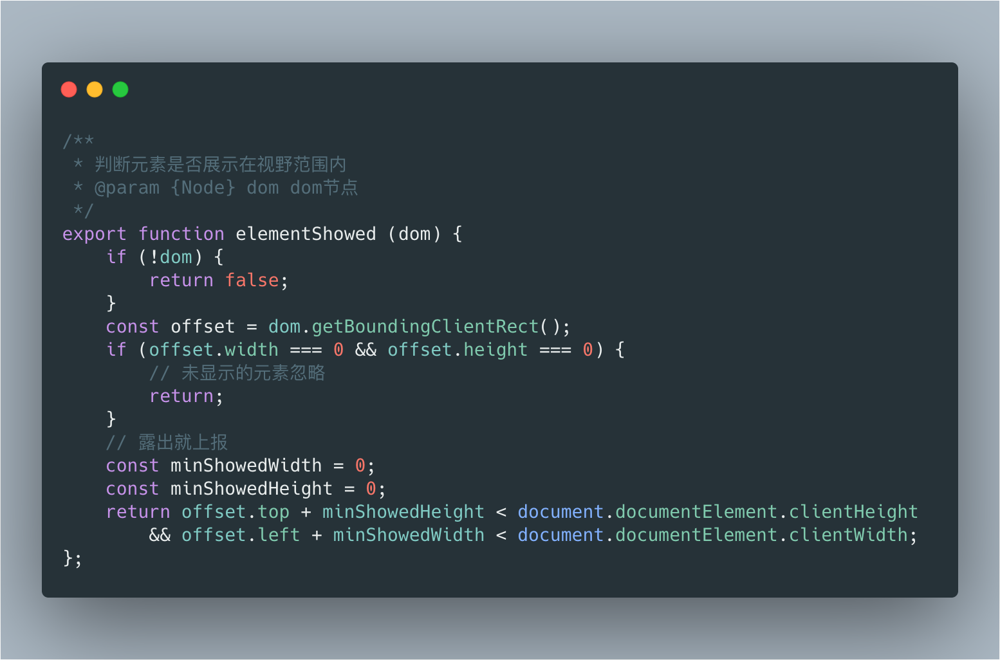
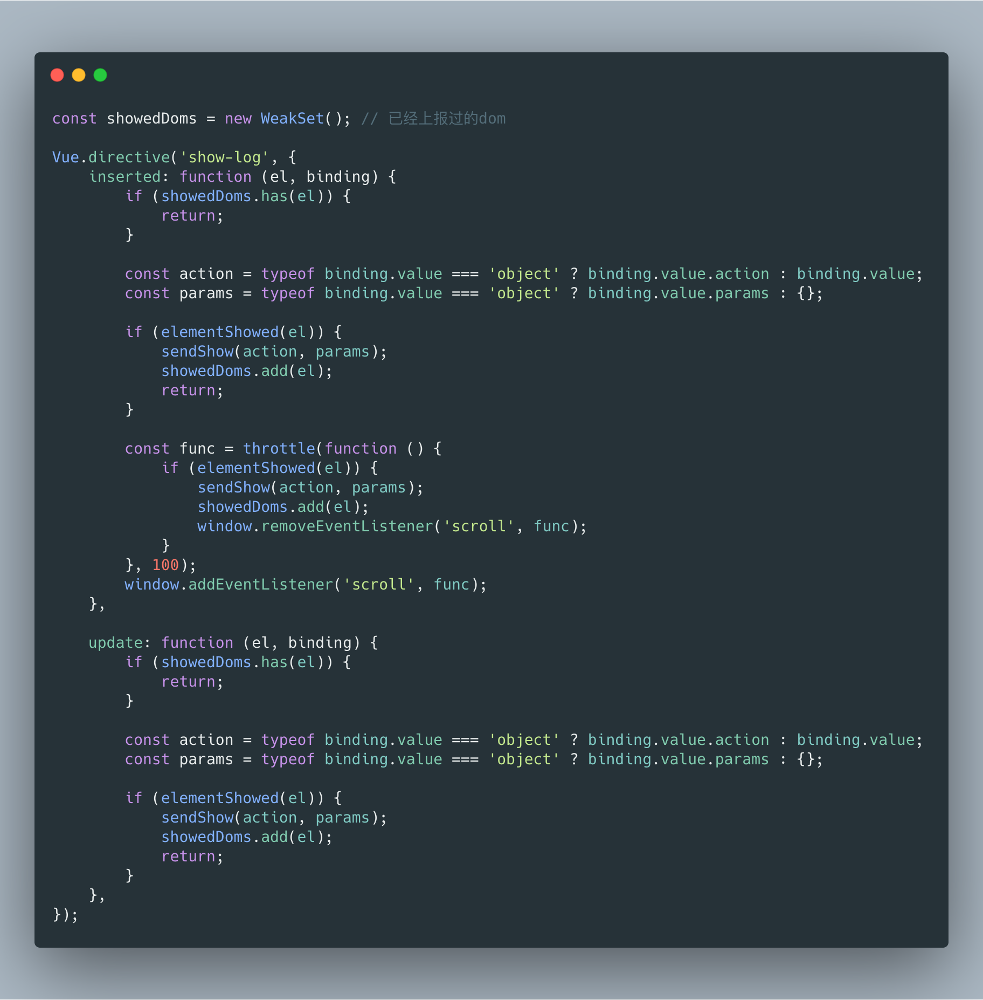
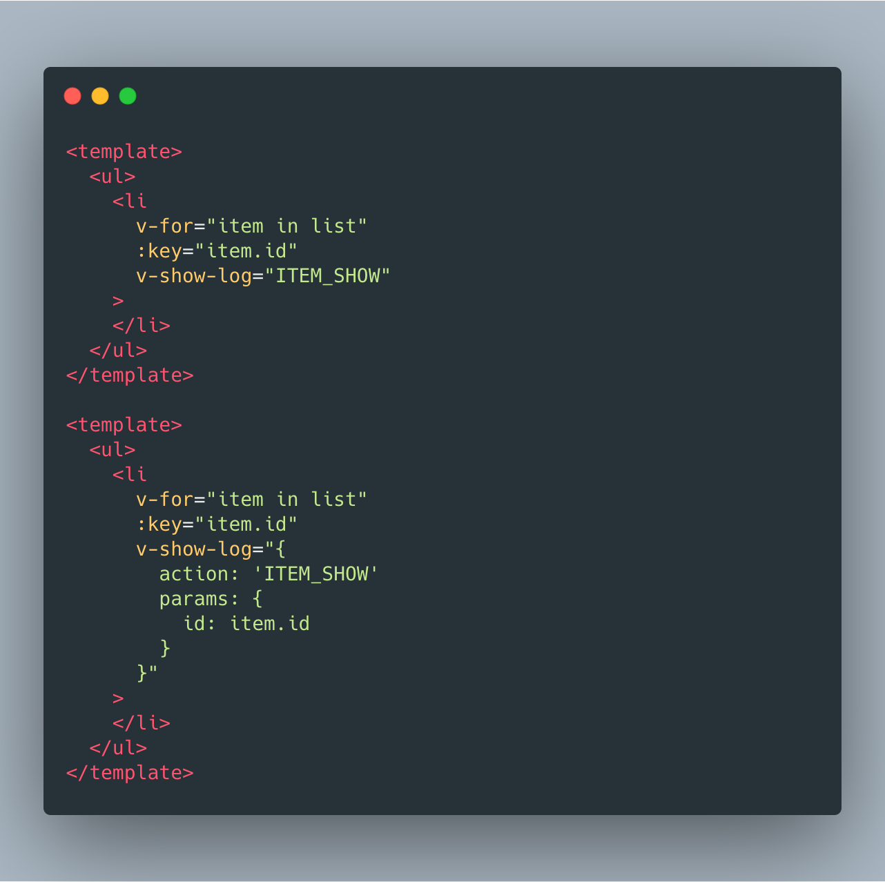

## 写在前面

之前在开发项目的时候，埋点直接放在了业务代码中。如果只是普通的点击埋点，在监听的事件里面增加一行埋点代码虽然不够优雅，确实无伤大雅。但这次需要对一个长列表中的元素进行曝光埋点上报，如果直接在业务代码中监听`scroll`事件，判断滚动的过程中元素是否展示，那会与业务耦合严重，代码不够清晰，因此决定优化一下。

## vue directive

曝光埋点需要判断元素是否可见，很容易想到vue自定义指令。让我们翻阅vue文档，来简单复习一下vue自定义指令。

一个指令定义对象可以提供如下几个钩子函数 (均为可选)：
* `bind`：只调用一次，指令第一次绑定到元素时调用。在这里可以进行一次性的初始化设置。
* `inserted`：被绑定元素插入父节点时调用 (仅保证父节点存在，但不一定已被插入文档中)。
* `update`：所在组件的 VNode 更新时调用，但是可能发生在其子 VNode 更新之前。
* `componentUpdated`：指令所在组件的 VNode 及其子 VNode 全部更新后调用。
* `unbind`：只调用一次，指令与元素解绑时调用。

## 需求分析

vue中一个元素的曝光，可能是`v-if`或`v-show`等状态切换导致，也可能是页面滚动的时候，原本未展示在视窗范围内的元素得到了曝光。因此我们可以在元素被插入到父节点的时候，判断一次元素是否曝光，未曝光就监听`window`的`scroll`事件，滚动过程中继续判断元素是否曝光。

## 具体实现

### 判断元素是否在可视区域

我们可以使用`Element.getBoundingClientRect()`方法获取元素的大小及其相对于视口的位置，然后与可视区域进行比较。

### directive设计

我们可以在`inserted`钩子函数中，判断元素是否在可视区域，如果在，则进行埋点上报；如果不在，则监听`window`的`scroll`事件，等到元素出现在可视区域的时候，移除`scroll`事件。

为了防止重复上报，对于已经曝光过的元素我们应该将其存储起来，而`WeakSet`非常适合用来存储dom元素。

>`WeakSet`中的对象都是弱引用，即垃圾回收机制不考虑 `WeakSet` 对该对象的引用，也就是说，如果其他对象都不再引用该对象，那么垃圾回收机制会自动回收该对象所占用的内存，不考虑该对象还存在于`WeakSet`之中。由于`WeakSet`的这个特性，适合用来储存 DOM 节点，而不用担心这些节点从文档移除时，会引发内存泄漏。

另外需要注意的是，在监听`scroll`这种频繁触发事件的时候，最好使用`throttle`减少触发次数。

最终我们的vue directive是这样的：

### 使用

我们可以使用如下方式使用：

